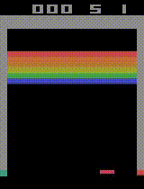
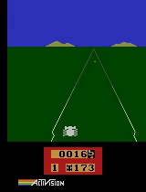
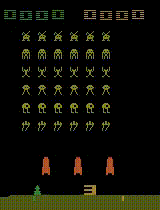

# Playing Atari with DQN

## (Working in Progress...)

This project implement DQN paper in Atari 2600 environment. The goal is to train an agent as similar as possible to original paper [DQN nature](https://www.nature.com/articles/nature14236) (such as preprocessing, frame skip, other hyperparameters... though there are some modification for practical reasons).

## Requirements
```
gym                 0.21.0
ale-py              0.7.3
torch               1.10.0
torchvision         0.11.1
```

## Results
## Video
| Breakout | Enduro | Space Invaders |
|:---: | :---: | :---: |
| |  |  |


## Game Score
DQN agent were trained for 10 million frames. Scores for each game are average over 10 episodes.

After training, run
`python test.py --env {env_name} --trained-mode-path {trained_model_path} --record-video` to compute average game score and record video (e.g.`python test.py --env ALE/Enduro-v5 --trained-model-path trained_model/Enduro.pt --record-video`). Add `--render-mode human` to test in interactive environment. Flags are defined in `get_test_args` function in [`parse_utils.py`](parse_utils.py).


Game | DQN (std)
:---:|:---:
Breakout | 97.3 (76.9)
Enduro | 275.1 (61.0)
Space Invaders | 313.0 (118.4)

Comparing the average score with original paper, this agent's performance degraded. I believe this is because of small replay memory size. Original paper  used a replay memory of 1 million most recent frames, but this agent is trained with 0.35 million replay memory size. This was just due to my PC's memory limit. You can easily modify replay memory size in [`config.yaml`](config.yaml)

## ROMs
You can  download Atari 2600 [roms](http://www.atarimania.com/rom_collection_archive_atari_2600_roms.html), unzip, place files below in [`ROMS`](ROMS) directory. Note that not all ROMS are supported by ALE. After placing ROM file, you can run `ale-import-roms ROMS` to check the ROM is supported.

In this project used 6 environments (Breakout, Space Invaders, Boxing, Pong, Enduro, Seaquest). For your information, ROMs that I tested are listed below.

**List of supported ROM for ALE**

	- Breakout - Breakaway IV (Paddle) (1978) (Atari, Brad Stewart - Sears) (CX2622 - 6-99813, 49-75107) ~.bin
	- Space Invaders (1980) (Atari, Richard Maurer - Sears) (CX2632 - 49-75153) ~.bin
	- Boxing - La Boxe (1980) (Activision, Bob Whitehead) (AG-002, CAG-002, AG-002-04) ~.bin
	- Pong - Video Olympics - Pong Sports (Paddle) (1977) (Atari, Joe Decuir - Sears) (CX2621 - 99806, 6-99806, 49-75104) ~.bin
	- Enduro - Enduro (1983) (Activision, Larry Miller) (AX-026, AX-026-04) ~.bin
	- Seaquest - Seaquest (1983) (Activision, Steve Cartwright) (AX-022) ~.bin
- To get more infomation about ALE, check [docs](https://github.com/mgbellemare/Arcade-Learning-Environment/tree/master/docs), [blog](https://github.com/mgbellemare/Arcade-Learning-Environment)

## Train
Run `python train.py --env CartPole-v0` to test if the algorithm works in relative simple environment.

## References
### Paper
- [DQN Nature](https://deepmind.com/research/publications/2019/human-level-control-through-deep-reinforcement-learning)
